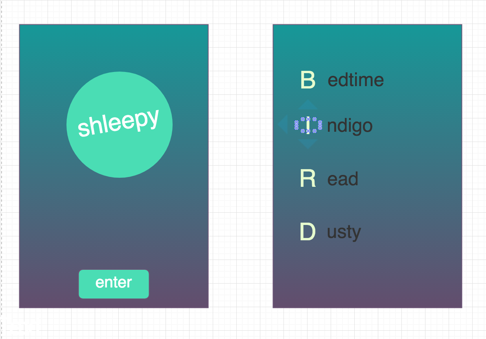

# shleepy
An interactive software designed on a conceptual framework and technique for sleep-onset
acceleration: the somnolent mentation framework adapted from Dr. Luc P. Beaudoin:

Journal/study

A new information-processing approach to sleep-onset acceleration and insomnia exemplified by serial diverse imagining

source: http://summit.sfu.ca/item/12143

User Story:
-Presented with welcome screen and welcome button to enter site

-User presses welcome button and enters game screen

-On game screen, a prompt at the top instructs user to pick from the many buttons visible

-Each button containing a word, user chooses one and proceeds to next game screen

-On game screen 2 user is presented with chosen word at the top of the page, and input field below

-User inputs a word beginning with letter highlighted above

-After accepting an input a button appears with a text of ‘next’ which creates 3 second timer/freeze and next blank input field

-User repeats previous 2 steps until desired and moves on to “done” button which highlights next letter above

-Previous 4 steps continue until desired completion time.

Structure
I expect to have a lot of difficulty with the placement of the text on the screen, and getting each letter to move into corresponding positions.

UI / UX will be a struggle because of the different size/orientation each new gameboard will have.

Phases of Completion

Plan, Draw, WireFrame, Test positioning, create components/functions, compile , Bug fixing.

Links and Resources

Journal source: http://summit.sfu.ca/item/12143

Cognitive Shuffle explanation: https://mysleepbutton.com/support/do-it-yourself-cognitive-shuffle-sdi/

Related News: http://www.cbc.ca/news/canada/british-columbia/sfu-sleep-trick-luc-beaudoin-1.4092294
